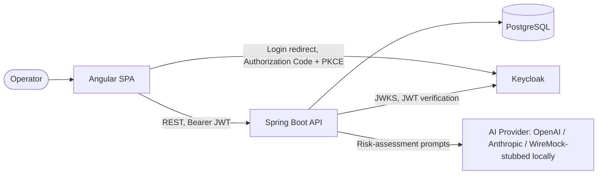

# Customer Activity Analytics

[](https://sonarcloud.io/summary/new_code?id=ADarko22_CustomerActivityAnalytics)
[](https://sonarcloud.io/summary/new_code?id=ADarko22_CustomerActivityAnalytics)
[](https://sonarcloud.io/summary/new_code?id=ADarko22_CustomerActivityAnalytics)
[](https://sonarcloud.io/summary/new_code?id=ADarko22_CustomerActivityAnalytics)
[](https://sonarcloud.io/summary/new_code?id=ADarko22_CustomerActivityAnalytics)

Web application enabling Financial Operators to overview customer activity and perform AI-aided risk analysis.

The application consists of a Java/Spring Boot [backend](backend/README.md) and an
Angular/Node.js [frontend](frontend/README.md), managed as a Gradle multi-module project. Dependencies are centralized
in the [libs.versions.toml](gradle/libs.versions.toml) catalog.

## How to Run

Prerequisites: JDK 25 (managed via the Gradle toolchain), Docker Desktop (or another Docker daemon) running. Node is
provisioned automatically by Gradle for the frontend.

- **Run everything locally, one terminal:**
    - `./gradlew dev` — starts Postgres (Docker Compose), the backend(`:8080`), and the frontend (`:4200`).
    - Stop with Ctrl-C.
- **Verify:**
    - `./gradlew check` — lint, tests, and coverage for both modules.
- **Build:**
    - `./gradlew build`.
- **Backend health:** http://localhost:8080/actuator/health.
- **Frontend:** http://localhost:4200.
- **AI risk assessments run offline by default** against a WireMock-stubbed LLM.
    - Configure `app.ai.provider` (or `AI_PROVIDER` env var) to select `openai` (default) or `anthropic`
    - Set the matching `OPENAI_API_KEY`/`OPENAI_MODEL` and `ANTHROPIC_API_KEY`/`ANTHROPIC_MODEL`
    - Clear the provider's `local`-profile `base-url` override (
      see [wiremock/README.md](local-environment/wiremock/README.md)).
    - ```   
      AI_PROVIDER=anthropic \
      ANTHROPIC_API_KEY=sk-ant-your-key-here \
      ANTHROPIC_MODEL=claude-haiku-4-5 \
      WIREMOCK_RECORD_MODE=true \
      WIREMOCK_PROXY_TARGET=https://api.anthropic.com \
      ./gradlew dev
      ```

## Architecture

Gradle multi-module project: a Spring Boot API, an Angular SPA, and a Docker Compose local environment.



- **`backend`** — Java 25, Spring Boot 4.1, Spring Data JPA + Flyway + PostgreSQL, Spring AI, OAuth2 resource
  server.
- **`frontend`** — Angular 22 + Angular Material + FontAwesome. Operator login gates the whole app
  (`angular-oauth2-oidc`, Authorization Code + PKCE against Keycloak).
- **`local-environment`** — Docker Compose: PostgreSQL, WireMock (canned AI responses for the offline demo — see
  [wiremock/README.md](local-environment/wiremock/README.md)), and Keycloak (realm provisioned from
  [keycloak/README.md](local-environment/keycloak/README.md) for demo logins).
- **CI (GitHub Actions)** — runs `./gradlew check` on every push/PR, plus a SonarCloud analysis pass.

## Key Design Decisions

The full, durable decision log — every choice made beyond the assignment PDF, with context and consequences — is
[DECISIONS.md](docs/DECISIONS.md). The handful most material to reviewing the approach:

- **D1 — Angular, not React**, for the frontend (the PDF allows substituting supporting technologies).
- **D2 — OAuth2/OIDC via Keycloak** for operator login (Authorization Code + PKCE, role-based access).
- **D3 — Server-Sent Events** for streaming AI risk-assessment progress to the UI.
- **D4 — WireMock-stubbed LLM by default**, so the demo runs offline and deterministically with no API key.
- **D6 — Two-table risk-assessment model**: an aggregate outcome table plus a per-rule line-item table.
- **D17 — RAG as structured DB filtering**, not a vector store — the risk-rules corpus is small and structured.
- **D19 — Multi-provider AI selection** (OpenAI/Anthropic) behind one swappable client interface.
- **D23 — Risk level is computed on read** from the stored numeric score, never persisted, so a threshold
  change is reflected retroactively.

## Assumptions

- **Local/demo use only:** default database credentials in [docker-compose.yml](local-environment/docker-compose.yml)
  and [application.yml](backend/src/main/resources/application.yml) are placeholders, overridable via environment
  variables.
- **AI risk assessments run against a WireMock-stubbed LLM by default** (offline, deterministic demo).
    - A real provider requires a real API key for the selected `app.ai.provider` (`OPENAI_API_KEY` or
      `ANTHROPIC_API_KEY`) and clearing that provider's `local` profile `base-url` override —
      see [wiremock/README.md](local-environment/wiremock/README.md).
- **Every `/api/v1/**` endpoint requires a valid Keycloak-issued OAuth2/OIDC JWT (D2);** 
  - Risk-rule require the `ADMIN` realm role.
  - Demo logins (`operator`/`password`, `admin`/`admin`) are provisioned.
- **Customer/transaction data is read-only and seeded for the demo**
    - The seed dataset only loads under the `local` Spring profile.
    - Risk rules have full CRUD, gated to the `ADMIN` role for.
- **Analytics aggregation is computed in memory over an unpaged, already-filtered row fetch**
    - no DB-side `GROUP BY`/indexes/materialized views yet, appropriate at the assignment's low-load/demo scale. See
      [PHASE_3_SCALING_NOTES.md](docs/development/PHASE_3_SCALING_NOTES.md) for the scale-up path.
- **The AI input guardrail is a config-driven regex safety net for PII-shaped content** (card PAN, IBAN, email,
  crypto wallet address)
    - A second line of defense behind the build-time `PromptContextMapper` allow-list, to cover erroneously data
      persisted and used to create the deterministic prompts
    - Scope/intent classifier for "out of scope querying" was deliberately not built; revisit if a free-text AI-facing
      feature is ever added.

## Implementation Journey

This project is implemented with the aid of AI tools and agents (the methodology is part of the assignment):

- **Gemini/ChatGPT/Claude Chatbot** — research, brainstorming, and refinement of the prompts driving the implementation.
- **Claude CLI** — the code implementation, driven by the specs in [docs/specs](docs/specs), the phase docs in
  [docs/development](docs/development), the commands in [.claude/commands](.claude/commands), and the project-wide
  guidelines in [CLAUDE.md](CLAUDE.md).

### Source of Truth

Precedence (highest wins), also enforced in [CLAUDE.md](CLAUDE.md):

```
sq_pe_assignment.pdf → PROJECT_SPECIFICATION.md → DECISIONS.md → PHASE_N.md → PHASE_N_PLAN.md → code
```

- [PROJECT_SPECIFICATION.md](docs/specs/PROJECT_SPECIFICATION.md) — technical requirements of record.
- [DECISIONS.md](docs/DECISIONS.md) — durable architectural and beyond-PDF decisions.
- [docs/development](docs/development) — per-phase definition (`PHASE_N.md`) and frozen plan (`PHASE_N_PLAN.md`).

### CLI Interactive Loop

Each phase is driven manually through Claude CLI. Commands take the phase id **without** the `.md` extension
(e.g. `PHASE_1`; a follow-up refinement scoped to an already-completed phase, such as a UX-only pass, uses an `_EXT`
suffix, e.g. `PHASE_2_EXT`, and runs through the identical loop below). The loop for a phase `N`:

1. **Plan** — `claude /plan-phase PHASE_N`
   - Reads the spec, decisions, and `PHASE_N.md`;
   - writes `docs/development/PHASE_N_PLAN.md`; sets `Status: PLANNED`;
   - stops. Touches no source.

2. **Review the plan** — `claude /review PHASE_N plan`
   - Audits the plan against the spec/decisions/phase. 
   -  On `REJECTED: <reasons>`, refine and re-run `/plan-phase PHASE_N`.
   - Loop until `APPROVED`.

3. **Implement** — `claude /implement PHASE_N`
   - Reads `PHASE_N_PLAN.md`; 
   - writes Java/TypeScript, Flyway migrations, and seed scripts; 
   - runs `./gradlew check` and `npm test`; 
   - sets `Status: IMPLEMENTED`.

4. **Review the code** — `claude /review PHASE_N code`
   - Inspects `git diff` and build/test output. 
   - On `REJECTED: <reasons>`, re-run `/implement PHASE_N`.
   - Loop until `APPROVED`.

5. **Complete** — `claude /complete PHASE_N`
   - Verifies acceptance criteria, freezes the plan (`Status: COMPLETE`). 
   - Promotes durable knowledge into this README and`DECISIONS.md`.
   - Sets the phase `Status: COMPLETE`.

6. **Commit** — `git add .` then
   - `claude "Generate a conventional git commit message for the changes and commit."`

## LLMs & Agent Instructions (assignment deliverable)

The AI risk-assessment feature integrates two providers via Spring AI — OpenAI and Anthropic — selected at runtime by
`app.ai.provider` (D19), each behind the same `RiskAssessmentAiClient` interface (D18).

By default, the app runs offline against a WireMock-stubbed LLM (D4), so the demo needs no API key; pointing it at a
real provider only requires setting that provider's API key/model env vars and clearing its `local`-profile
`base-url` override (see [wiremock/README.md](local-environment/wiremock/README.md) for the record-mode toggle that
captures new stubs from real responses).

**Agent instructions given.**

The whole application was built with Claude Code CLI, driven by a fixed instruction hierarchy rather than ad hoc
prompting.

[CLAUDE.md](CLAUDE.md) sets the coding standards and a strict source-of-truth precedence (PDF → spec → decisions → phase
docs → code, see "Source of Truth" above).

Every phase of work follows the same five-command loop described in "CLI Interactive Loop" —
`/plan-phase` →`/review ... plan` → `/implement` → `/review ... code` → `/complete` — so the agent always plans against
a written blueprint, and only proceeds once each step is explicitly approved.

Durable decisions the agent made beyond the PDF's own text are recorded, not just implemented —
see [DECISIONS.md](docs/DECISIONS.md).
